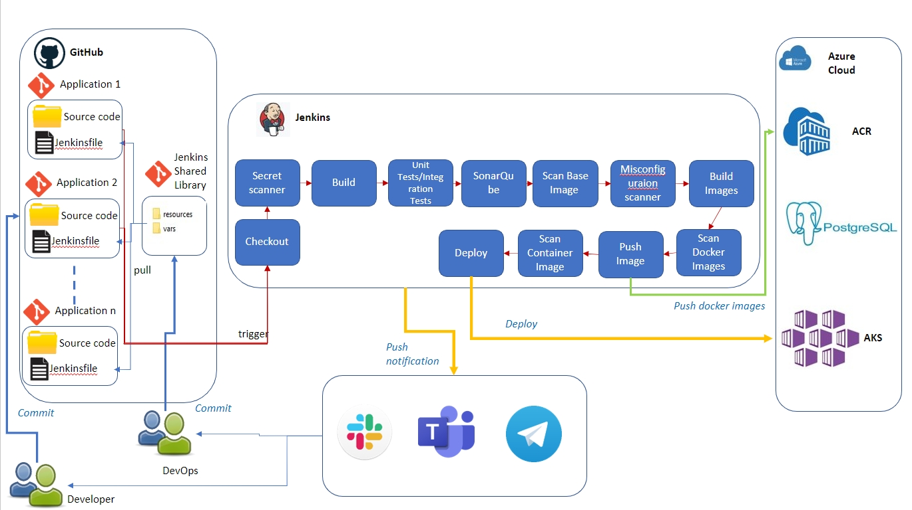

					____  _______     ______  _____ ____ ___  ____  ____  
					|  _ \| ____\ \   / / ___|| ____/ ___/ _ \|  _ \/ ___| 
					| | | |  _|  \ \ / /\___ \|  _|| |  | | | | |_) \___ \ 
					| |_| | |___  \ V /  ___) | |__| |__| |_| |  __/ ___) |
					|____/|_____|  \_/  |____/|_____\____\___/|_|   |____/ 

# DevSecOps Project
This is the devsecops project and will contain all automation related to CI Architecture. 

	
Folder Structure
 - resources - Jenkins Library Resources (External libraries may load adjunct files from a resources/ directory using the libraryResource step)
 - vars - Jenkins Libarary Scripts (Only entire pipelines can be defined in shared libraries as of this time. This can only be done in vars/*.groovy, and only in a call method. Only one Declarative Pipeline can be executed in a single build, and if you attempt to execute a second one, your build will fail as a result.)
 - training - Include some groovy templates to implementing ci/cd flow with Groovy script.

# What you'll learn
- Understand the basics of the Jenkins architecture.
- Understand the concept of the Job DSL Plugin on Jenkins and its features.
- Understand with Shared Libraries and Plug-ins
- Implement CICD Pipelines With Jenkins Groovy script
- Understand the basic scenario CICD flow (Build -> Run Testing -> Build Images -> Sonar analysis -> Quality Gateway -> Push Images -> Deploy)

# Prerequisite
- Working knowledge of Jenkins
- Basic knowledge of automation and the CI-CD strategy
- Basic knowledge of Docker and K8S

# Install Jenkins
- Install JDK
  	```
      sudo apt update
      sudo apt install openjdk-17-jre -y
      sudo apt install openjdk-17-jdk -y
   	```
- Install Jenkins
  	```
   curl -fsSL https://pkg.jenkins.io/debian-stable/jenkins.io-2023.key | sudo tee \
  /usr/share/keyrings/jenkins-keyring.asc > /dev/null
   echo deb [signed-by=/usr/share/keyrings/jenkins-keyring.asc] \
  https://pkg.jenkins.io/debian-stable binary/ | sudo tee \
  /etc/apt/sources.list.d/jenkins.list > /dev/null
   sudo apt-get update
   sudo apt-get install jenkins -y
   	```
# Install Docker
```
# Add Docker's official GPG key:
sudo apt-get update
sudo apt-get install ca-certificates curl gnupg
sudo install -m 0755 -d /etc/apt/keyrings
curl -fsSL https://download.docker.com/linux/ubuntu/gpg | sudo gpg --dearmor -o /etc/apt/keyrings/docker.gpg
sudo chmod a+r /etc/apt/keyrings/docker.gpg

# Add the repository to Apt sources:
echo \
  "deb [arch="$(dpkg --print-architecture)" signed-by=/etc/apt/keyrings/docker.gpg] https://download.docker.com/linux/ubuntu \
  "$(. /etc/os-release && echo "$VERSION_CODENAME")" stable" | \
  sudo tee /etc/apt/sources.list.d/docker.list > /dev/null
sudo apt-get update

sudo apt-get install docker-ce docker-ce-cli containerd.io docker-buildx-plugin docker-compose-plugin

# Add Jenkins user into docker group
sudo usermod -aG docker jenkins
```

# Install kubectl
```
   curl -LO "https://dl.k8s.io/release/$(curl -L -s https://dl.k8s.io/release/stable.txt)/bin/linux/amd64/kubectl"
   sudo install -o root -g root -m 0755 kubectl /usr/local/bin/kubectl
   kubectl version --client
```

# Install Trivy
```
# Debian/Ubuntu 
sudo apt-get install wget apt-transport-https gnupg lsb-release
wget -qO - https://aquasecurity.github.io/trivy-repo/deb/public.key | sudo apt-key add -
echo deb https://aquasecurity.github.io/trivy-repo/deb $(lsb_release -sc) main | sudo tee -a /etc/apt/sources.list.d/trivy.list
sudo apt-get update
sudo apt-get install trivy
Refer: https://aquasecurity.github.io/trivy/v0.29.2/getting-started/installation/
```

# Install Sonar
```
Refer: https://www.fosstechnix.com/how-to-install-sonarqube-on-ubuntu-22-04-lts/
```

# Requirement
- Jenkins Server has
	- installed some
		- Plugins:
			- Jenkins suggested
 			- Docker Pipeline
			- xUnit plugin
			- Cobertura Plugin
			- Code Coverage Plugin
            - HTML Publisher plugin
			- Pipeline Utility Steps
			- Kubernetes plugin
   			- Kubernetes CLI Plugin
			- Kubernetes Credentials Plugin
		- Tools:
			- kubectl cli
			- docker
            - trivy
	- added credentials: http://jenkinsserver:8080/manage/credentials/store/system/domain/_/
		- GitHub with Kind Username with password (ID name: github)
  		- GitHub Manage Webhook with Kind Secret text (ID name: githubserver)	 
		- ACR with Kind Username with password (ID name: acr-demo-token)
		- SonarQube Token with Kind Secret text (ID name: sonar-token)
  		- Connection Strings (database info) with Kind Secret text (ID name: connectionstrings)
		- kubeconig with Kind Secret file (ID name: aksdemo)
  		 
	- manage Jenkins -> System
 		- GitHub Servers
   			- Name: ```github```
			- API URL: https://api.github.com
			- Credentials: ```githubserver```
           	- [x] Manage hooks   
   		- GitHub Enterprise Servers
			- API endpoint: https://api.github.com
			- Name: github
		- Global Pipeline Libraries
			- Name: ```jenkins-devops-ci```
			- Default version: ```pisharped```
			- [x] Allow default version to be overridden
			- [x] Include @Library changes in job recent changes 
		- Retrieval method: Modern SCM
			- Source Code Management: Git
			- Project Repository: https://github.com/LocTaRND/jenkins-devops-ci.git
			- Credentials: ```github```
    		
 
- SonarQube Server
  	- Generate Tokens: http://sonarserver:9000/account/security
  	

- Resource Group:
	- Create resource group called: ```demo```
- ACR
	- Create ACR called: ```pisharpeddemo ```
  	- Admin user: ```Enable```
  	

- SQL Server:
	- Create SQL server called: ```pisharpeddemo```
   	
	- Create database name called: ```projecttemplate```
	
 
- AKS
	- Create AKS called: ```demo```
	- Attach an ACR to an AKS cluster:
   		```az aks update -n demo -g demo --attach-acr pisharpeddemo```
- Repositories:
	- https://github.com/nashtech-garage/dotnet-bookstore-api/tree/jenkins
   
# Refer
- https://www.jenkins.io/doc/book/pipeline/shared-libraries/
- https://learn.microsoft.com/en-us/azure/aks/cluster-container-registry-integration?tabs=azure-cli
- https://www.jenkins.io/doc/book/pipeline/syntax/
- https://www.eficode.com/blog/jenkins-groovy-tutorial
